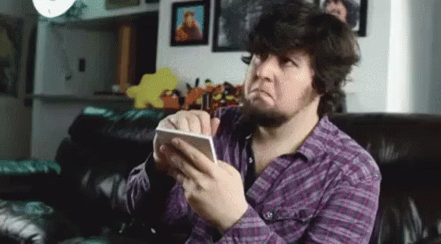

#   ESPAÑOL:

## <i align="center" style="font-size:2rem"> 📝 LISTA DE TAREAS CON REACT </i>

En este proyecto se usaron hooks como **useState** y tecnologias **CSS,HTML,Javascript,React,SASS**

_Este proyecto se realizo con el proposito de practicar React_
 

## 💡 Como se penso este proyecto y como funciona¡

**_Idea Principal : Una simple aplicacion para tomar notas_**

Mi idea era simple , queria una app para tomar notas que el usuario escriba lo que quiera y que la app le muestre sus diferentes notas en pequeñas cartas/recuadros

Primero que nada , Hice el "generador" de notas que es la caja en donde los usuarios escriben dentro y presionan el boton **_"generate TODO"_** y lo que el usuario haya escrito se va a almacenar en el estado principal de la app que es **_"List"_**

Con lo contenido dentro del estado "List" se va a renderizar las diferentes notas y van a poseer 2 botones . Uno para eliminar la nota y otro para editarla

Si el usuario presiona eliminar , se eliminara la nota por completo . Si el usuario decide editarla , se habilitara la edicion del contenido dentro de la nota

Para los estilos use SASS , por que me siento muy comodo y me parece una herramienta que es muy eficiente

-------------------------------------------------------
-------------------------------------------------------

#  ENGLISH:

## <i align="center" style="font-size:2rem">🗒️ TO-DO APP WITH REACT</i> 

In this project  was used hooks like **useState** and technologies like **CSS,HTML,Javascript,React,SASS**

This proyect was built with the purpose of practising React
 

## 🤔 How i thought about the project and its functioning

**_Main Idea : Simple ToDo List_**

My idea was simple , I wanted a To-Do list app that when user will write anything to do ; the app shows  all stuff´s user into a little To-Do cards

First of all , I made a "to-do generator" that is a box that if the user writes into it and clicks button "generate ToDo" ,the content into the box will storage into the main state of the app, the  "List"

With the stuff contained into the "List" state , will be render "To-Do Card/s".Each has two buttons , one is delete and the other is edit .

If user clicks delete , the "To-Do Card" will be delete. If the user clicks edit , the "To-Do Card" will be availaible for edit the content and change or not the task

For the styles i use SASS, because i feel so confortable and for me it´s very eficient this tool